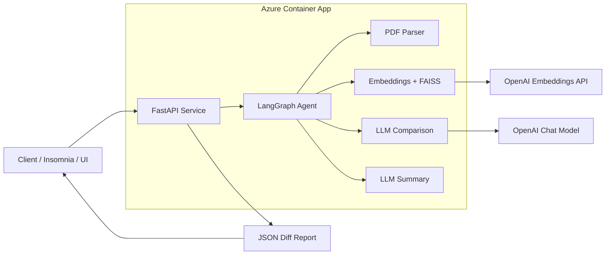
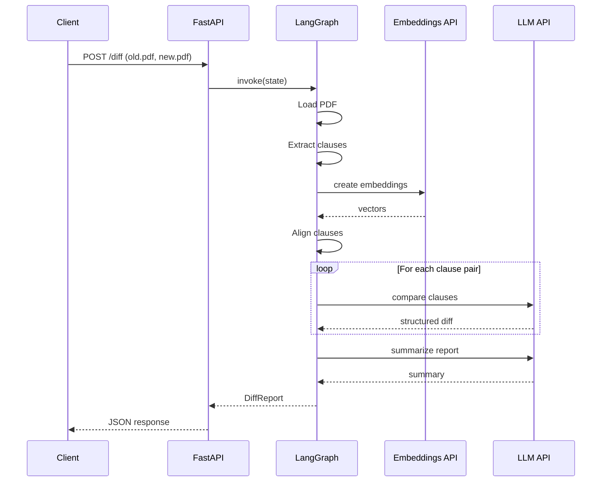

# Contract Diff Agent

An agentic workflow for **semantic comparison of two contract PDFs**.  
The system does not rely on naive text diff — it aligns clauses by meaning and evaluates legal risk of changes.

LIVE DEMO with UI: https://l-agent.calmcliff-3f483547.swedencentral.azurecontainerapps.io/


---

## Configuration

The service can be customized via environment variables (see `.env` for examples):

- `OPENAI_API_KEY` – your OpenAI key for embeddings/chat.
- `OTEL_EXPORT_ENABLED` – set to `true` or `false` to enable or disable OpenTelemetry span exporting (default: `true`).
- any other settings used by `api.py` or the agent as described below.


## What the agent does

Given two documents:

old.pdf  — previous version  
new.pdf  — updated version

The agent produces a **structured legal diff report** describing:

- added clauses
- removed clauses
- materially modified clauses
- unchanged clauses
- legal risk level of each change
- overall summary

---

## How comparison works

The comparison is performed in 5 stages:

### 1. Load & normalize
PDF files are loaded and converted to plain text.

Normalization removes:
- broken spacing
- duplicated newlines
- null characters

The agent works with clean semantic text, not raw PDF layout.

---

### 2. Clause extraction
The contract is split into numbered clauses using pattern:
```
1.  
1.1  
2.3.4  
5)  
10.2.1  
```
Each clause becomes a unit:
```
{
  "clause_id": "4.2",
  "text": "The Supplier shall deliver the goods within 30 days..."
}
```
If a document has no numbering — it is treated as a single clause.

---

### 3. Semantic alignment (NOT text diff)

Clauses are matched using embeddings similarity:

- embeddings: text-embedding-3-large
- vector search: FAISS
- similarity threshold: 0.38

This solves real legal problems:

| Case | Traditional diff | This agent |
|----|----|----|
| Clause moved | removed + added | matched |
| Reworded legally same | modified | unchanged |
| Meaning changed slightly | often missed | modified |
| Clause renumbered | broken | matched |

Alignment result example:
```
{
  "clause_id": "7.1",
  "old": "...payment within 30 days...",
  "new": "...payment within 10 days...",
  "score": 0.91,
  "status": "matched"
}
```
Possible statuses:
- matched
- added
- removed

---

### 4. Legal comparison (LLM analysis)

Each aligned pair is analyzed by an LLM acting as a legal assistant.

Rules:
- style changes → unchanged
- meaning change → modified
- missing in old → added
- missing in new → removed

The model also evaluates risk level based on:
- money
- liability
- termination
- obligations
- deadlines
- legal exposure

---

### 5. Report generation

Finally the agent produces a structured report and an overall summary of risky changes.

---

## Output format

The agent returns a JSON DiffReport:
```
{
  "items": [
    {
      "clause_id": "5.2",
      "change_type": "modified",
      "old_text": "Payment within 30 days",
      "new_text": "Payment within 10 days",
      "summary": "Payment deadline reduced",
      "risk": "high",
      "rationale": "Creates stricter financial obligation"
    }
  ],
  "overall_summary": "The new version significantly increases payment pressure and supplier liability..."
}
```
### Change types

| Type | Meaning |
|----|----|
| added | Clause appears only in new document |
| removed | Clause removed from new document |
| modified | Legal meaning changed |
| unchanged | Only wording/style changed |

### Risk levels

| Level | Meaning |
|----|----|
| low | cosmetic or clarifying |
| medium | operational impact |
| high | financial / liability / termination impact |


## Technologies

The agent is built using an LLM-oriented agentic stack and semantic search components.

### LLM & Agent Framework
- LangChain — tool abstraction and LLM orchestration
- LangGraph — stateful agent workflow
- OpenAI API — reasoning + embeddings

### Semantic Comparison
- OpenAI Embeddings (text-embedding-3-large)
- FAISS — vector similarity search

### Document Processing
- PyPDF — PDF text extraction
- Regex clause parser — structured contract segmentation

### Data Modeling
- Pydantic — structured schema validation for diff reports

### API & Runtime
- FastAPI — HTTP service interface
- Uvicorn — ASGI server
- python-dotenv — environment configuration

### Utilities
- tqdm — processing progress

## API Endpoints

The service exposes a minimal HTTP API for contract comparison.

### POST /diff
Compare two contract versions.

**Request**
- multipart/form-data
- fields:
  - `old` — previous contract (.pdf)
  - `new` — updated contract (.pdf)

**Response**
```json
{
  "request_id": "uuid",
  "report": {
    "items": [...],
    "overall_summary": "..."
  }
}
````

The report contains a structured semantic diff with legal risk analysis.

---

### GET /health

Health check endpoint.

**Response**

```json
{
  "status": "ok"
}
```

## Running the service

You can start the FastAPI server directly or with Docker:

```bash
# run locally with env file
uvicorn api:app --host 0.0.0.0 --port 8000
```

## Running in Docker

The service is intended to run inside a container.

### Build image

```bash
docker build -t legal-diff-agent .
````

### Run container

```bash
docker run -p 8000:8000 --env-file .env legal-diff-agent
```

The API will be available at:

http://localhost:8000

---

The container:

* installs all dependencies
* runs the FastAPI server via Uvicorn
* exposes port `8000`
* requires `OPENAI_API_KEY` with OpenAI API key
